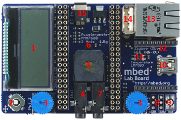

# Mbed Application Board BSP

Mbed Application Board board support CMSIS Software Pack.

## Directory Structure

| Directory            | Content                                                   |                
|:-------------------- |:--------------------------------------------------------- |
| Documentation        | Manuals, schematics, and board images                     |
| Drivers              | CMSIS-Drivers VIO                                         |
| Projects             | Examples using the provided drivers                       |

## License

## Contributions and Pull Requests

Contributions are accepted under Apache 2.0. Only submit contributions where you have authored all of the code.
